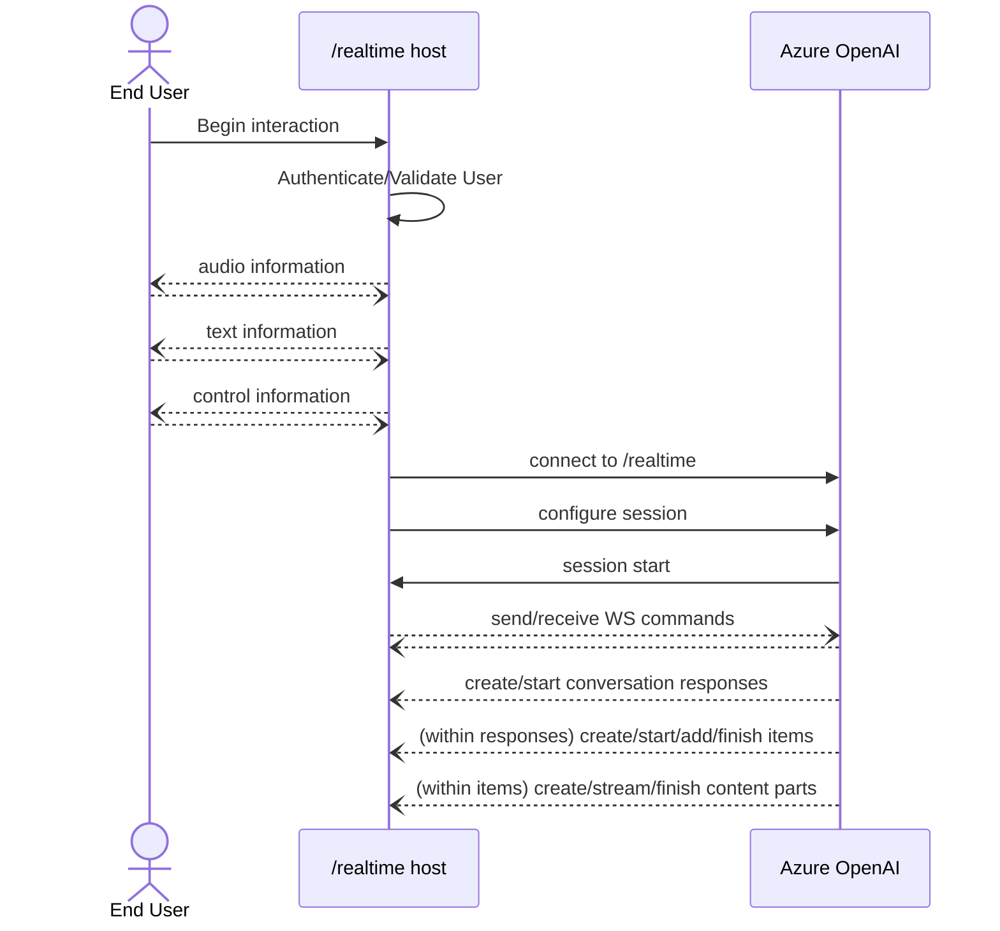

# Azure OpenAI GPT-4o Audio and /realtime: Public Preview Documentation

Welcome to the Public Preview for Azure OpenAI `/realtime` using `gpt-4o-realtime-preview`! This repository provides documentation, standalone libraries, and sample code for using `/realtime` -- applicable to both Azure OpenAI and standard OpenAI v1 endpoint use.

## Overview: what's /realtime?

This preview introduces a new `/realtime` API endpoint for the `gpt-4o-realtime-preview` model family. `/realtime`:

- Supports low-latency, "speech in, speech out" conversational interactions
- Works with text messages, function tool calling, and many other existing capabilities from other endpoints like `/chat/completions`
- Is a great fit for support agents, assistants, translators, and other use cases that need highly responsive back-and-forth with a user

`/realtime` is built on [the WebSockets API](https://developer.mozilla.org/en-US/docs/Web/API/WebSockets_API) to facilitate fully asynchronous streaming communication between the end user and model. It's designed to be used in the context of a trusted, intermediate service that manages both connections to end users and model endpoint connections; it **is not** designed to be used directly from untrusted end user devices, and device details like capturing and rendering audio data are outside the scope of the `/realtime` API.

At a summary level, the architecture of an experience built atop `/realtime` looks something like the following (noting that the user interactions, as previously mentioned, are not part of the API itself):



Note that `/realtime` is in **public preview**. API changes, code updates, and occasional service disruptions are expected.

## How to get started

- Create an Azure OpenAI resource using the `eastus2` or `swedencentral` region
- Deploy the `gpt-4o-realtime-preview` model (`2024-10-01` version) to one of these supported resources
- Use one of the included samples to see `/realtime` in action

## Connecting to and authenticating with `/realtime`

The `/realtime` API requires an existing Azure OpenAI resource endpoint in a supported region. A full request URI can be constructed by concatenating:

1. The secure WebSocket (`wss://`) protocol
2. Your Azure OpenAI resource endpoint hostname, e.g. `my-aoai-resource.openai.azure.com`
3. The `openai/realtime` API path
4. An `api-version` query string parameter for a supported API version -- initially, `2024-10-01-preview`
5. A `deployment` query string parameter with the name of your `gpt-4o-realtime-preview` model deployment

Combining into a full example, the following could be a well-constructed `/realtime` request URI:

```http
wss://my-eastus2-openai-resource.openai.azure.com/openai/realtime?api-version=2024-10-01-preview&deployment=gpt-4o-realtime-preview-1001
```

To authenticate:
- **Using Microsoft Entra**: `/realtime` supports token-based authentication with against an appropriately configured Azure OpenAI Service resource that has managed identity enabled. Use a `Bearer` token with the `Authorization` header to apply a retrieved authentication token.
- **Using an API key**: An `api-key` can be provided in one of two ways:
  1. Using an `api-key` connection header on the pre-handshake connection (note: not available in a browser environment)
  2. Using an `api-key` query string parameter on the request URI (note: query string parameters are encrypted when using https/wss)

## API concepts

- A caller establishes a connection to `/realtime`, which starts a new `session`
- The `session` can be configured to customize input and output audio behavior, voice activity detection behavior, and other shared settings
- A `session` automatically creates a default `conversation`
  - Note: in the future, multiple concurrent conversations may be supported -- this is not currently available
- The `conversation` accumulates input signals until a `response` is started, either via a direct command by the caller or automatically by voice-activity-based turn detection
- Each `response` consists of one or more `items`, which can encapsulate messages, function calls, and other information
- Message `item`s have `content_part`s, allowing multiple modalities (text, audio) to be represented across a single item
- The `session` manages configuration of caller input handling (e.g. user audio) and common output/generation handling
- Each caller-initiated `response.create` can override some of the output `response` behavior, if desired
- Server-created `item`s and the `content_part`s in messages can be populated asynchronously and in parallel, e.g. receiving audio, text, and function information concurrently (round robin)

## API details

Once the WebSocket connection session to `/realtime` is established and authenticated, the functional interaction takes place via sending and receiving WebSocket messages, herein referred to as "commands" to avoid ambiguity with the content-bearing "message" concept already present for inference. These commands each take the form of a JSON object. Commands can be sent and received in parallel and applications should generally handle them both concurrently and asynchronously.

For a full, structured description of request and response commands, see [realtime-openapi3.yml](realtime-openapi3.yml). As with other aspects of the public preview, note that the protocol specifics may be subject to change.

**Session configuration and turn handling mode**

Often, the first command sent by the caller on a newly-established `/realtime` session will be a `session.update` payload. This command controls a wide set of input and output behavior, with output and response generation portions then later overrideable via `response.create` properties, if desired.

One of the key session-wide settings is `turn_detection`, which controls how data flow is handled between the caller and model:

- `server_vad` will evaluate incoming user audio (as sent via `input_audio_buffer.append`) using a voice activity detector (VAD) component and automatically use that audio to initiate response generation on applicable conversations when an end of speech is detected. Silence detection for the VAD can be configured when specifying `server_vad` detection mode.
- `none` will rely on caller-initiated `input_audio_buffer.commit` and `response.create` commands to progress conversations and produce output. This is useful for push-to-talk applications or situations that have external audio flow control (such as caller-side VAD component). Note that these manual signals can be still be used in `server_vad` mode to supplement VAD-initiated response generation.

Transcription of user input audio is opted into via the `input_audio_transcription` property; specifying a transcription model (`whisper-1`) in this configuration will enable the delivery of `conversation.item.audio_transcription.completed` events.

An example `session.update` that configures several aspects of the session, including tools, follows. Note that all session parameters are optional; not everything needs to be configured!

```json
{
  "type": "session.update",
  "session": {
    "voice": "alloy",
    "instructions": "Call provided tools if appropriate for the user's input.",
    "input_audio_format": "pcm16",
    "input_audio_transcription": {
      "model": "whisper-1",  // We can also choose from "gpt-4o-mini-transcribe" or "gpt-4o-transcribe"
      "language": "en", // optional language (ISO-639-1 format)
      "prompt":"words you can expect in the input" // optional
    },
    "turn_detection": {
      "threshold": 0.4,
      "silence_duration_ms": 600,
      "type": "server_vad"
    },
    "tools": [
      {
        "type": "function",
        "name": "get_weather_for_location",
        "description": "gets the weather for a location",
        "parameters": {
          "type": "object",
          "properties": {
            "location": {
              "type": "string",
              "description": "The city and state e.g. San Francisco, CA"
            },
            "unit": {
              "type": "string",
              "enum": [
                "c",
                "f"
              ]
            }
          },
          "required": [
            "location",
            "unit"
          ]
        }
      }
    ]
  }
}
```

## Summary of commands

See [realtime-openapi3.yml](realtime-openapi3.yml) for full parameter details.

### Requests: commands sent from the caller to the `/realtime` endpoint

| `type` | Description |
|---|---|
| **Session Configuration** | |
| `session.update` | Configures the connection-wide behavior of the conversation session such as shared audio input handling and common response generation characteristics. This is typically sent immediately after connecting but can also be sent at any point during a session to reconfigure behavior after the current response (if in progress) is complete. |
| **Input Audio** | |
| `input_audio_buffer.append` | Appends audio data to the shared user input buffer. This audio will not be processed until an end of speech is detected in the `server_vad` `turn_detection` mode or until a manual `response.create` is sent (in either `turn_detection` configuration). |
| `input_audio_buffer.clear` | Clears the current audio input buffer. Note that this will not impact responses already in progress. |
| `input_audio_buffer.commit` | Commits the current state of the user input buffer to subscribed conversations, including it as information for the next response. |
| **Item Management** | For establishing history or including non-audio item information |
| `conversation.item.create` | Inserts a new item into the conversation, optionally positioned according to `previous_item_id`. This can provide new, non-audio input from the user (like a text message), tool responses, or historical information from another interaction to form a conversation history prior to generation. |
| `conversation.item.delete` | Removes an item from an existing conversation |
| `conversation.item.truncate` | Manually shortens text and/or audio content in a message, which may be useful in situations where faster-than-realtime model generation produced significant additional data that was later skipped by an interruption. |
| **Response Management** |
| `response.create` | Initiates model processing of unprocessed conversation input, signifying the end of the caller's logical turn. `server_vad` `turn_detection` mode will automatically trigger generation at end of speech, but `response.create` must be called in other circumstances (text input, tool responses, `none` mode, etc.) to signal that the conversation should continue. **Note**: when responding to tool calls, `response.create` should be invoked *after* the `response.done` command from the model that confirms all tool calls and other messages have been provided. |
| `response.cancel` | Cancels an in-progress response. |


### Responses: commands sent by the `/realtime` endpoint to the caller

| `type` | Description |
|---|---|
| `session.created` | Sent as soon as the connection is successfully established. Provides a connection-specific ID that may be useful for debugging or logging. |
| `session.updated` | Sent in response to a `session.update` event, reflecting the changes made to the session configuration. |
| **Caller Item Acknowledgement** | |
| `conversation.item.created` | Provides acknowledgement that a new conversation item has been inserted into a conversation. |
| `conversation.item.deleted` | Provides acknowledgement that an existing conversation item has been removed from a conversation. |
| `conversation.item.truncated` | Provides acknowledgement that an existing item in a conversation has been truncated. |
| **Response Flow** | |
| `response.created` | Notifies that a new response has started for a conversation. This snapshots input state and begins generation of new items. Until `response.done` signifies the end of the response, a response may create items via `response.output_item.added` that are then populated via `*delta*` commands. |
| `response.done` | Notifies that a response generation is complete for a conversation. |
| `rate_limits.updated` | Sent immediately after `response.done`, this provides the current rate limit information reflecting updated status after the consumption of the just-finished response. |
| **Item Flow in a Response** | |
| `response.output_item.added` | Notifies that a new, server-generated conversation item *is being created*; content will then be populated via incremental `add_content` messages with a final `response.output_item.done` command signifying the item creation has completed. |
| `response.output_item.done` | Notifies that a new conversation item has completed its addition into a conversation. For model-generated messages, this is preceded by `response.output_item.added` and `*delta*` commands which begin and populate the new item, respectively. |
| **Content Flow within Response Items** | |
| `response.content_part.added` | Notifies that a new content part is being created within a conversation item in an ongoing response. Until `response_content_part_done` arrives, content will then be incrementally provided via appropriate `*delta`* commands. |
| `response.content_part.done` | Signals that a newly created content part is complete and will receive no further incremental updates. |
| `response.audio.delta` | Provides an incremental update to a binary audio data content part generated by the model. |
| `response.audio.done` | Signals that an audio content part's incremental updates are complete. |
| `response.audio_transcript.delta` | Provides an incremental update to the audio transcription associated with the output audio content generated by the model. |
| `response.audio_transcript.done` | Signals that the incremental updates to audio transcription of output audio are complete. |
| `response.text.delta` | Provides an incremental update to a text content part within a conversation message item. |
| `response.text.done` | Signals that the incremental updates to a text content part are complete. |
| `response.function_call_arguments.delta` | Provides an incremental update to the arguments of a function call, as represented within an item in a conversation. |
| `response.function_call_arguments.done` | Signals that incremental function call arguments are complete and that accumulated arguments can now be used in their entirety. |
| **User Input Audio** | |
| `input_audio_buffer.speech_started` | When using configured voice activity detection, this command notifies that a start of user speech has been detected within the input audio buffer at a specific audio sample index. |
| `input_audio_buffer.speech_stopped` | When using configured voice activity detection, this command notifies that an end of user speech has been detected within the input audio buffer at a specific audio sample index. This will automatically trigger response generation when configured. |
| `conversation.item.input_audio_transcription.completed` | Notifies that a supplementary transcription of the user's input audio buffer is available. This behavior must be opted into via the `input_audio_transcription` property in `session.update`. |
| `conversation.item_input_audio_transcription.failed` | Notifies that input audio transcription failed. |
| `input_audio_buffer_committed` | Provides acknowledgement that the current state of the user audio input buffer has been submitted to subscribed conversations. |
| `input_audio_buffer_cleared` | Provides acknowledgement that the pending user audio input buffer has been cleared. |
| **Other** | |
| `error` | Indicates that something went wrong while processing data on the session. Includes an `error` message that provides additional detail. |


## Troubleshooting and FAQ

Best practices and expected patterns are evolving rapidly and topics represented in this section may become quickly out of date.

### I send audio, but see no commands back from the service

- Ensure that the input audio format matches what was provided in the `session.update` command (24KHz, 16-bit mono PCM by default); if the format doesn't match, it will be decoded as "noise" and not be interpreted as input.
- If using the `none` `turn_detection` mode (`null` in newer protocol versions), ensure you send `input_audio_buffer.commit` and/or `response.create` commands as needed.

### Tool calling isn't working or isn't responding

As a single response can feature multiple tool calls, a bit of statefulness is introduced with the tool call/response contract:

- The caller may add a tool call output item `tool_call` at any point after the `item_added` message for that tool call arrives.
- Once all items for the current response have been generated, the model's `response.done` command will arrive, including references in `output` to all tool calls and other items that were part of the response.
- At this point (once all incoming tool calls have been resolved), the caller can send a new `response.create` command.
- Sending the `response.create` command *before* the paired `response.done` command for the prior response arrives (e.g. immediately after an `response.function_call_arguments.done` or `response.output_item.done`) may produce unexpected behavior and race conditions.
- Not sending any `response.create` command may fail to advance the conversation.

### Using an audio file as input, I see many responses or my responses get stuck

When using lengthy audio input that's significantly faster than real time -- such as from an audio file with natural pauses -- server voice activity detection can trigger many responses in rapid succession and this can cause responses to become unreliable. It's highly recommended to disable voice activity detection (`"turn_detection": { "type": "none" }` (`"turn_detection": null` in newer protocol versions) in `session.update`) for such scenarios and instead manually invoke `response.create` when all audio has been transmitted.

### What's the long-term plan for library support?

The shortest answer: many details are still TBD.

- **.NET** (https://github.com/openai/openai-dotnet): preview support for `/realtime` is available now, beginning with the `2.1.0-beta.1` release. SDK representations within the beta library version are subject to continued development, refinement, and adaptation -- some number of breaking changes across preview versions are expected.
- **Python** and **JavaScript**: As described [in the "What's next" section of the Realtime announcement](https://openai.com/index/introducing-the-realtime-api/#whats_next), official library support (via https://github.com/openai/openai-python and https://github.com/openai/openai-node) is coming at a later date. The timelines and specifics will be shared a bit further on, but we should expect converged support for `/realtime` alongside other client capabilities like `/chat/completions` in the future. In the meantime, this repository provides standalone libraries (compatible with both standard OpenAI and Azure OpenAI) with samples and will continue to be expanded and improved.
- **Java** and **Go**: Client library support discussions are underway and we hope to have more to share soon.
