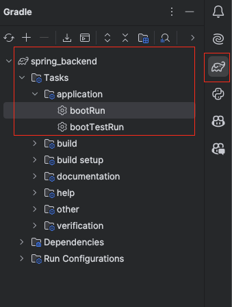
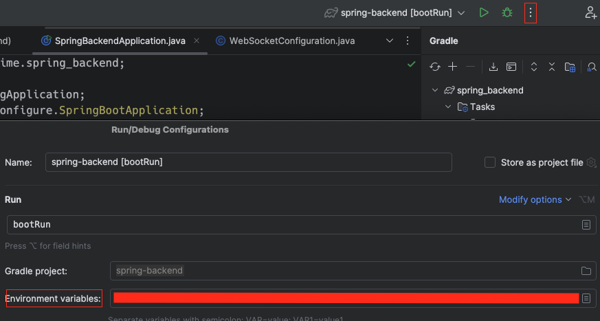

## Setup

- Get Java version 17 (recommended tooling: [sdkman](https://sdkman.io/usage/))

## Run 

### Command line

To run the server `./gradlew bootRun`

### Intellij

Find the `bootRun` task in the gradle task panel:



Once you have found the right gradle task `application->bootRun` modify the configuration like shown in the image:



## Apendix 1: Using the WebSocketPinger.py script for testing

To setup a python venv run the following:

```commandline
python3 -m venv venv
source venv/bin/activate
python3 -m pip install websockets
```

And when you are done, run: 

```commandline
deactivate
```
