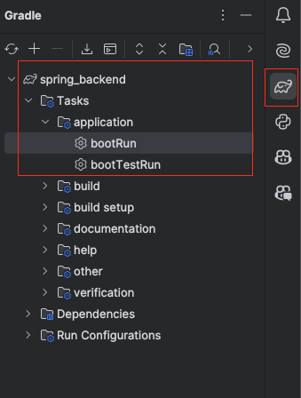
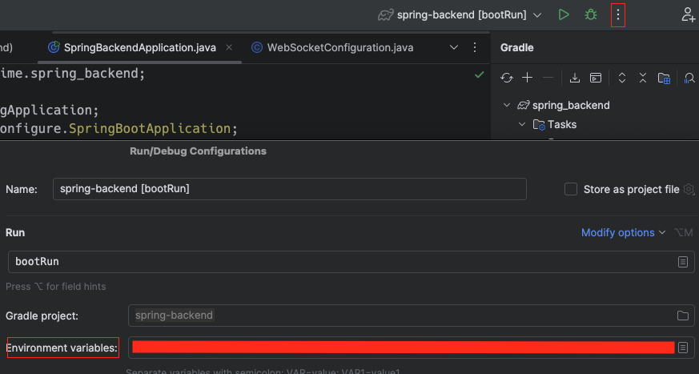

# Realtime Backend FastAPI Sample

This Spring Boot application serves as a middle-tier service to mediate connections with the Azure OpenAI or OpenAI Realtime API. It introduces a simplified protocol for backend communication, covering only the necessary functionalities and allowing easy extensions.

## Overview

The service establishes a WebSocket server that communicates with clients using a custom protocol. It translates client messages into the appropriate format for the backend API (Azure OpenAI or OpenAI Realtime API) and handles responses, forwarding them back to the client.

## Features

- **Simplified Protocol**: Uses a custom, lightweight communication protocol.
- **Backend Support**: Works with both Azure OpenAI and OpenAI Realtime APIs.
- **Extendable**: Easily extend the protocol to cover additional functionalities.
- 
## Environment Variables

Set the following environment variables in a `.env` file at the root of the project:

### Common Variables

- `BACKEND`: Specify the backend to use (`azure` or `openai`).
- `PORT` (optional): Port number for the server (default is `8080`).
- `ADDRESS` (optional): Server host (default is `localhost`).

### Using Azure OpenAI Backend

- `AZURE_OPENAI_ENDPOINT`: Your Azure OpenAI endpoint URL.
- `AZURE_OPENAI_DEPLOYMENT`: The name of your Azure OpenAI deployment.

### Using OpenAI Realtime API Backend

- `OPENAI_API_KEY`: Your OpenAI API key.
- `OPENAI_MODEL`: The model to use (e.g., `gpt-3.5-turbo`).

## Setup and Run

- Get Java version 17 (recommended tooling: [sdkman](https://sdkman.io/usage/))
- (Recommended) Install Intellij IDE and run/debug using their tooling.

### Command line

To run the server `./gradlew bootRun`

### Intellij

Find the `bootRun` task in the gradle task panel and run it:



If you have setup a `.env` file in the root of the project, `application->bootRun` should launch the application with the values you've specified. 

Alternatively, if you prefer not having a `.env` file, modify the IDE's launch configuration like shown in the image:



## Custom Protocol

The application defines its own protocol for client-server communication:

- **Control Messages**: Manage connection status and actions (e.g., connected, speech_started, text_done).
- **User Messages**: Send user text inputs (user_message).
- **Transcriptions**: Receive transcribed text from audio inputs (transcription).
- **Text Deltas**: Stream partial text responses (text_delta).

This protocol focuses on essential features and can be extended as needed.

## Type Definitions

The protocol messages are defined using Python's typing system:

```java
class TextDelta {
    String id;
    MessageType type = MessageType.TEXT_DELTA;
    String delta;
}

class UserMessage {
    String id;
    MessageType type = MessageType.USER_MESSAGE;
    String text;
}

class TranscriptionMessage {
    String id;
    MessageType type = MessageType.TRANSCRIPTION;
    String text;
}

class ControlMessage {
    MessageType type = MessageType.CONTROL;
    String action;
    String greeting;
    String id;
}
```

## Notes

- Ensure that the required environment variables are set correctly for your chosen backend.
- Logging is configured using slf4j and can be adjusted through its configuration.
- The server implements CORS middleware with permissive settings for development. Adjust these settings for production use.
